---

## title: "Arquitectura del sistema Novagendas" description: "Documentación técnica completa: arquitectura, módulos, flujos, diagramas UML y decisiones de diseño del sistema Novagendas."

# Documentación Técnica — Arquitectura del Sistema Novagendas

## 1. Resumen General del Proyecto

Novagendas es una **plataforma SaaS multi-tenant de gestión de citas** orientada a clínicas estéticas, spas y negocios de servicios de salud. Opera bajo un modelo de **subdominio por negocio** (`tunegocio.novagendas.com`), donde cada tenant tiene un espacio de trabajo completamente aislado: su propia base de datos lógica, sus usuarios, sus citas, su inventario y su configuración.

El sistema no expone un portal público de autoagendamiento a clientes finales. Es una **herramienta de operaciones internas** controlada exclusivamente por el equipo del negocio.

---

## 2. Objetivo del Sistema

| Dimensión | Descripción |
| --- | --- |
| **Funcional** | Gestión integral del ciclo de vida de una cita: desde el agendamiento hasta el pago, el historial clínico y el control de inventario |
| **Operacional** | Centralizar en una sola interfaz las operaciones de recepción, especialistas y administración |
| **Técnico** | Proveer aislamiento de datos por tenant, control de acceso granular por rol y extensibilidad vía integraciones externas |
| **Negocio** | Reducir la fricción operativa de clínicas de mediano tamaño que gestionan sus procesos con herramientas dispersas |

---

## 3. Arquitectura General

Novagendas sigue una **arquitectura de aplicación web multi-tenant con subdominio dinámico**, organizada en capas bien definidas.

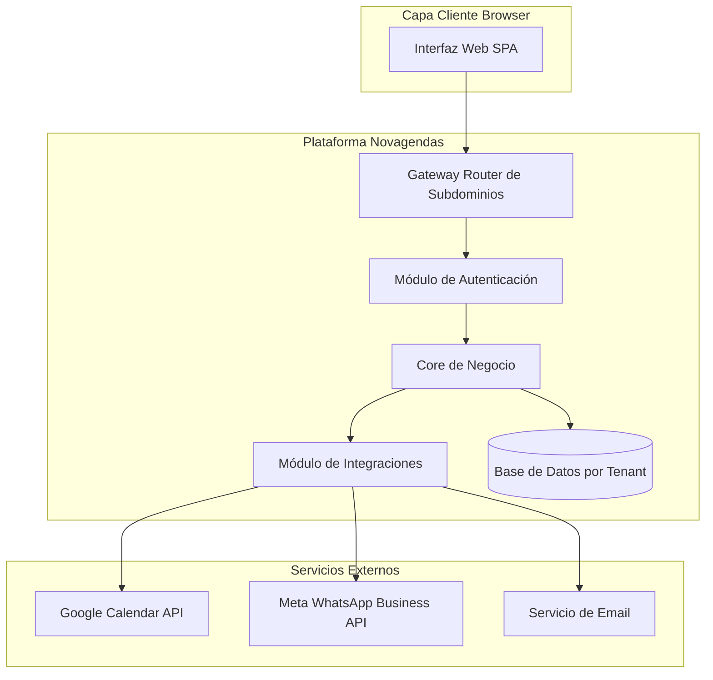

### Capas principales

| Capa | Responsabilidad |
| --- | --- |
| **Routing por Subdominio** | Identifica el tenant a partir del subdominio entrante y enruta la sesión al espacio correcto |
| **Autenticación** | Valida credenciales, genera sesiones con TTL 24h, controla acceso por rol |
| **Core de Negocio** | Lógica de dominio: citas, clientes, servicios, pagos, inventario, equipo |
| **Integraciones** | Adaptadores hacia Google Calendar API y WhatsApp Business API de Meta |
| **Base de Datos** | Persistencia por tenant con aislamiento lógico |

---

## 4. Estructura del Proyecto

```text
/
├── introduction.mdx           # Descripción general del producto
├── quickstart.mdx             # Guía de inicio rápido
├── roles-and-permissions.mdx  # Modelo de acceso por roles
│
├── features/
│   ├── agenda.mdx             # Módulo de calendario y citas
│   ├── clients.mdx            # Módulo de gestión de clientes
│   ├── services.mdx           # Catálogo de servicios
│   ├── payments.mdx           # Módulo financiero pagos y abonos
│   ├── inventory.mdx          # Control de inventario y stock
│   └── statistics.mdx         # Reportes y estadísticas
│
├── integrations/
│   ├── google-calendar.mdx    # Integración con Google Calendar
│   └── whatsapp-bot.mdx       # Bot de agendamiento vía WhatsApp
│
├── admin/
│   ├── team-management.mdx    # Gestión de usuarios y roles
│   ├── locations.mdx          # Gestión de sedes físicas
│   ├── audit-logs.mdx         # Registro de auditoría
│   └── holidays.mdx           # Días bloqueados en el calendario
│
└── account/
    ├── login.mdx              # Autenticación
    ├── password-reset.mdx     # Recuperación de contraseña
    └── profile.mdx            # Perfil de usuario
```

---

## 5. Componentes Principales

### 5.1 Módulo de Autenticación y Sesiones

- Cada negocio tiene un **subdominio único** como punto de entrada. No existe login centralizado.
- Las sesiones tienen un **TTL fijo de 24 horas** sin renovación automática.
- El acceso post-login depende exclusivamente del **rol del usuario**.
- El flujo de recuperación de contraseña emite un token de un solo uso y tiempo limitado por correo.

<Note>
  **Decisión técnica:** El uso de subdominios exclusivos por tenant refuerza el aislamiento a nivel DNS y previene confusión de contexto entre negocios.
</Note>

### 5.2 Módulo de Control de Acceso (RBAC)

El sistema implementa **Role-Based Access Control (RBAC)** con tres roles fijos:

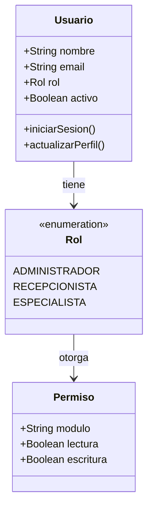

| Rol | Módulos accesibles |
| --- | --- |
| **Administrador** | Todos: Agenda, Clientes, Servicios, Pagos, Inventario, Usuarios, Estadísticas, Auditoría, Sedes, Bot |
| **Recepcionista** | Agenda, Clientes, Servicios lectura, Inventario lectura |
| **Especialista** | Agenda propias, Clientes propios, Perfil |

<Note>
  **Decisión técnica:** Los permisos de módulo pueden sobreescribirse individualmente por usuario mediante la cuadrícula de **Módulos Permitidos**, lo que permite granularidad sin cambiar el rol base.
</Note>

### 5.3 Módulo de Agenda (Core de Citas)

Es el módulo central. Gestiona el ciclo de vida completo de una cita.

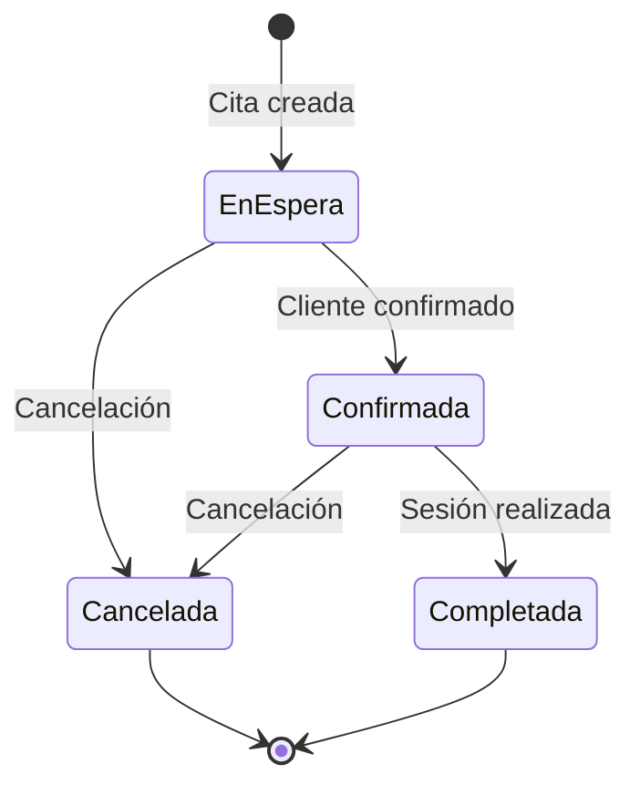

**Comportamientos clave:**

- **Detección de conflictos**: al guardar o arrastrar, el sistema verifica superposición de horarios por especialista.
- **Drag and drop**: reprogramación visual en vistas Día y Semana.
- **Descuento de inventario**: al crear una cita con productos, el stock se decrementa automáticamente (solo en creación, no en edición).
- **Sincronización externa**: si Google Calendar está conectado, cada operación dispara una actualización al calendario vinculado.

### 5.4 Módulo de Clientes (Ficha Clínica)

Cada cliente tiene una **ficha clínica** compuesta por:

- Datos de identidad: documento, nombre, teléfono, email
- Historial de citas: todas las sesiones pasadas y futuras
- Notas de evolución clínica: firmadas, con marca de tiempo, **inmutables** una vez guardadas
- Consentimiento Habeas Data: obligatorio, conforme a Ley 1581 colombiana

<Note>
  **Decisión técnica:** Las notas clínicas son de solo escritura hacia adelante (append-only). No se permite editar ni eliminar una nota existente, garantizando integridad del historial médico.
</Note>

### 5.5 Módulo de Pagos y Abonos

Separa dos flujos financieros distintos:

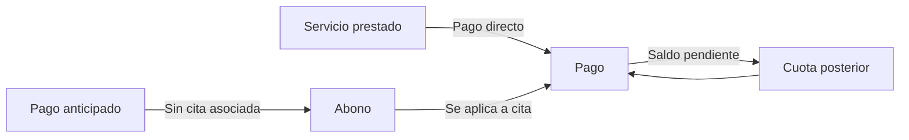

| Tipo | Descripción | Estado posible |
| --- | --- | --- |
| **Pago** | Vinculado a un servicio | Pagado / Pago Parcial |
| **Abono** | Depósito libre con saldo | Disponible / Aplicado |

### 5.6 Módulo de Inventario

- Stock controlado por **umbral mínimo** configurable por producto.
- Alertas visuales en tres niveles: Verde saludable, Ámbar moderado, Rojo crítico.
- El consumo se registra automáticamente al crear citas con productos asignados.
- Los productos no se eliminan; se **desactivan** (soft delete) para preservar el histórico.

### 5.7 Módulo de Estadísticas

Siete vistas de KPIs con exportación a Excel:

| Pestaña | KPI Principal |
| --- | --- |
| General | Citas del mes, ingresos, tasa de cancelación |
| Citas | Volumen por día y hora, especialistas top |
| Pacientes | Nuevos, activos, en riesgo con más de 60 días sin cita |
| Servicios | Más solicitados, ingresos por servicio |
| Pagos y Abonos | Ingresos diarios, depósitos activos |
| Inventario | Stock crítico, valor total |
| Usuarios | Distribución por rol, actividad del equipo |

---

## 6. Relaciones Entre Módulos

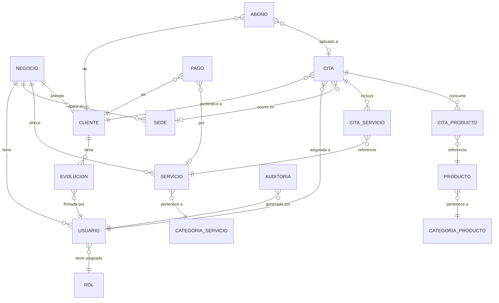

---

## 7. Flujos Críticos del Sistema

### 7.1 Flujo de Autenticación por Subdominio

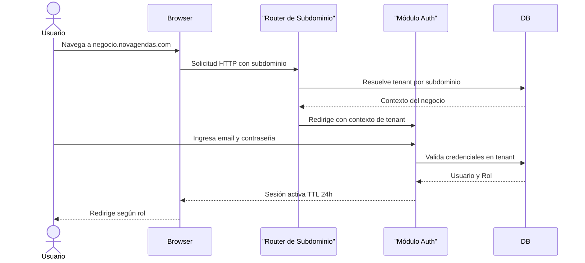

### 7.2 Flujo de Creación de Cita con Sincronización

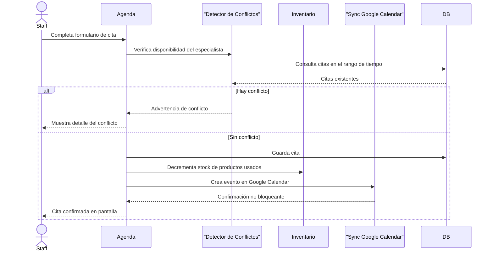

<Note>
  **Decisión técnica:** La sincronización con Google Calendar es **no bloqueante**. Si falla, la cita se guarda igualmente en Novagendas, garantizando disponibilidad del sistema ante fallos de la API externa.
</Note>

### 7.3 Flujo de Agendamiento vía Bot de WhatsApp

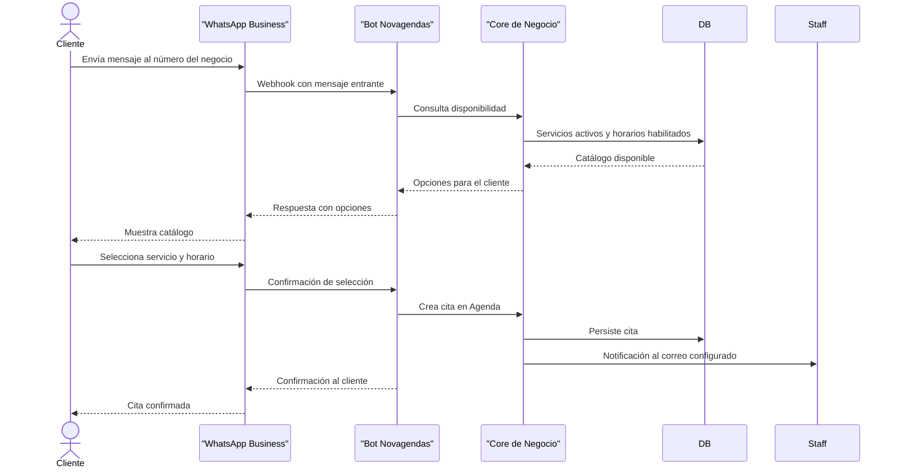

---

## 8. Diagramas UML

### 8.1 Diagrama de Casos de Uso

```mermaid
flowchart TD
    subgraph Sistema ["Sistema Novagendas"]
        UC1["Gestionar citas"]
        UC2["Gestionar clientes"]
        UC3["Registrar pagos"]
        UC4["Controlar inventario"]
        UC5["Ver estadísticas"]
        UC6["Gestionar equipo"]
        UC7["Gestionar sedes"]
        UC8["Ver auditoría"]
        UC9["Configurar bot WhatsApp"]
        UC10["Conectar Google Calendar"]
        UC11["Gestionar perfil"]
        UC12["Bloquear días"]
    end

    Admin(["Administrador"])
    Recep(["Recepcionista"])
    Espec(["Especialista"])

    Admin --> UC1 & UC2 & UC3 & UC4 & UC5
    Admin --> UC6 & UC7 & UC8 & UC9 & UC10 & UC11 & UC12

    Recep --> UC1 & UC2 & UC4 & UC11

    Espec --> UC1 & UC2 & UC11
```

### 8.2 Diagrama de Componentes

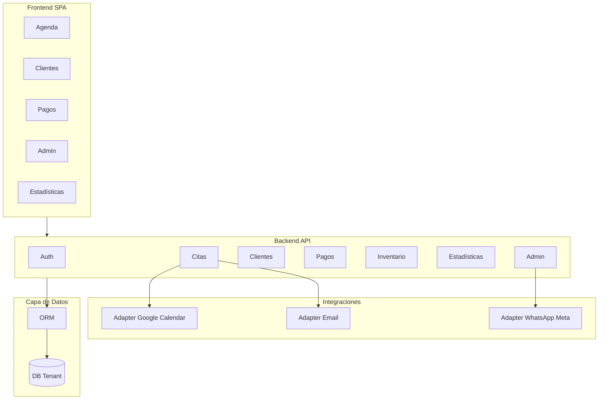

### 8.3 Diagrama de Actividades — Registro de Pago Parcial

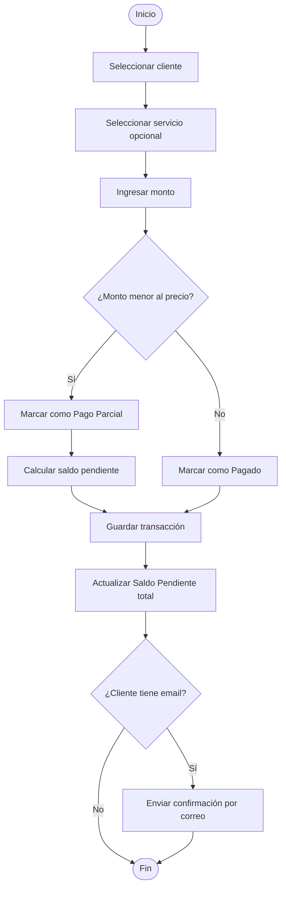

---

## 9. Fragmentos de Código Clave

### 9.1 Middleware de Control de Acceso por Rol

El sistema evalúa el rol del usuario en cada carga de sección. Si el rol no tiene acceso, se redirige silenciosamente al panel principal.

```js
// Pseudocódigo — Middleware de autorización
function verificarAcceso(usuario, modulo) {
  // 1. Permisos base del rol (tabla fija por tipo de rol)
  const permisosRol = PERMISOS_BASE[usuario.rol]

  // 2. Sobreescrituras individuales configuradas por el Admin
  const permisosCustom = usuario.modulosPermitidos

  // 3. Combinar — los permisos custom tienen precedencia sobre el rol base
  const permisoFinal = { ...permisosRol, ...permisosCustom }

  // 4. Redirigir sin exponer el motivo del rechazo al usuario
  if (!permisoFinal[modulo]?.lectura) {
    redirigir('/dashboard')
    return false
  }
  return true
}
```

**Explicación:**

- **Línea 4:** Los permisos base son una tabla fija por tipo de rol, no modificable en tiempo de ejecución.
- **Línea 7:** Los permisos personalizados son la cuadrícula de módulos configurada individualmente por el Admin.
- **Línea 10:** El spread combina ambos objetos; los permisos custom sobreescriben los del rol.
- **Línea 13:** La redirección es silenciosa — el usuario ve el panel, no un error 403, evitando exponer la estructura de permisos.

### 9.2 Creación de Cita con Guardas Encadenadas

```js
// Pseudocódigo — Crear cita con validaciones encadenadas
async function crearCita(datosCita) {
  // 1. Validar conflictos ANTES de cualquier escritura
  const conflicto = await verificarConflicto(
    datosCita.especialistaId,
    datosCita.fechaInicio,
    datosCita.fechaFin
  )
  if (conflicto) throw new ConflictError(conflicto)

  // 2. Persistir la cita en la base de datos
  const cita = await guardarCita(datosCita)

  // 3. Decrementar inventario — SOLO en creación nueva, nunca en edición
  for (const producto of datosCita.productos) {
    await decrementarStock(producto.id, producto.cantidad)
  }

  // 4. Sincronizar con Google Calendar de forma NO bloqueante
  sincronizarGoogleCalendar(cita).catch(err => logError(err))

  return cita
}
```

**Puntos clave:**

- **Paso 1:** La verificación de conflictos ocurre antes de cualquier escritura, garantizando consistencia.
- **Paso 3:** El decremento de stock solo se ejecuta en `crearCita`, nunca en `editarCita`. Esto previene doble conteo de inventario.
- **Paso 4:** `.catch()` aísla el fallo de la API externa. La función retorna la cita aunque Google Calendar falle.

### 9.3 Resolución de Tenant por Subdominio

```js
// Pseudocódigo — Middleware de resolución de tenant
function resolverTenant(request, next) {
  // Extrae "clinica-norte" de "clinica-norte.novagendas.com"
  const subdominio = extraerSubdominio(request.hostname)

  const tenant = buscarTenantPorSubdominio(subdominio)

  if (!tenant || !tenant.activo) {
    throw new TenantNotFoundError()
  }

  // Inyecta el contexto de tenant — todas las consultas posteriores usan este ID
  request.tenantId = tenant.id
  request.tenantConfig = tenant.configuracion

  return next()
}
```

**Explicación:** El `tenantId` inyectado en `request` se usa como filtro en **todas** las consultas a la base de datos que siguen en la cadena de middlewares. Sin este filtro, los datos de distintos negocios podrían mezclarse entre sí.

---

## 10. Configuración y Dependencias

### 10.1 Integraciones Externas

| Integración | Proveedor | Autenticación | Alcance |
| --- | --- | --- | --- |
| **Google Calendar** | Google APIs | OAuth 2.0 por negocio | Crear, editar y eliminar eventos; enviar invitaciones a clientes y especialistas |
| **WhatsApp Business** | Meta Embedded Signup | OAuth Meta por negocio | Enviar y recibir mensajes; gestionar conversaciones de agendamiento |
| **Email transaccional** | Proveedor configurable | \[API\_KEY\] | Confirmaciones, cancelaciones, restablecimiento de contraseña |

### 10.2 Variables de Entorno Requeridas

```bash
# Base de datos
DB_HOST=[ENV_VAR]
DB_PORT=[ENV_VAR]
DB_NAME=[ENV_VAR]
DB_USER=[ENV_VAR]
DB_PASSWORD=[SECRET]

# Autenticación y sesiones
JWT_SECRET=[SECRET]
SESSION_TTL=86400

# Google Calendar OAuth
GOOGLE_CLIENT_ID=[API_KEY]
GOOGLE_CLIENT_SECRET=[SECRET]
GOOGLE_REDIRECT_URI=[PRIVATE_URL]

# Meta / WhatsApp Business
META_APP_ID=[API_KEY]
META_APP_SECRET=[SECRET]
META_WEBHOOK_VERIFY_TOKEN=[SECRET]

# Email transaccional
EMAIL_PROVIDER_API_KEY=[API_KEY]
EMAIL_FROM=[ENV_VAR]

# Aplicación
APP_BASE_DOMAIN=novagendas.com
APP_PORT=[ENV_VAR]
NODE_ENV=production
```

### 10.3 Zona Horaria

Todo el sistema opera en **`America/Bogota` (UTC-5)**. Los eventos sincronizados con Google Calendar incluyen esta zona horaria de forma explícita para evitar desplazamientos en clientes con configuraciones regionales distintas.

---

## 11. Buenas Prácticas Observadas

| Práctica | Módulo donde se aplica |
| --- | --- |
| **Soft delete generalizado** | Clientes, servicios, productos, pagos — preserva integridad referencial e histórico |
| **Append-only en notas clínicas** | Garantiza integridad del historial médico sin posibilidad de alteración posterior |
| **RBAC con sobreescritura por usuario** | Flexibilidad operativa sin romper el modelo de roles |
| **Integraciones externas no bloqueantes** | Resiliencia ante fallos de Google Calendar o Meta |
| **Aislamiento de tenant por subdominio** | Separación a nivel DNS, aplicación y base de datos |
| **Registro de auditoría CRUD completo** | Trazabilidad total de acciones por usuario y entidad |
| **TTL fijo de sesión 24h** | Seguridad predecible sin complejidad de refresh tokens |
| **Consentimiento Habeas Data obligatorio** | Cumplimiento de Ley 1581 de Colombia en registro de clientes |

---

## 12. Riesgos, Limitaciones y Puntos de Mejora

### Riesgos Técnicos

| Riesgo | Nivel | Mitigación recomendada |
| --- | --- | --- |
| **Fallo silencioso de sincronización con Google Calendar** | Medio | Implementar cola de reintentos con backoff exponencial |
| **Sesiones activas tras desactivar usuario** | Medio | La sesión persiste 24h tras desactivar la cuenta; considerar lista negra de tokens |
| **Sin rate limiting documentado en bot WhatsApp** | Medio | Implementar throttling por número de teléfono para prevenir abuso |
| **Cambio de subdominio rompe integraciones OAuth** | Bajo | Documentar proceso de migración incluyendo reconexión de Google y Meta |

### Limitaciones Actuales

- **Sin autoagendamiento público:** diseño intencional; el bot de WhatsApp es la única vía semi-externa.
- **Un solo Administrador por negocio:** limita la delegación de tareas administrativas.
- **Zona horaria fija Bogotá:** sin soporte multi-zona horaria para operación en múltiples países.
- **Exportación únicamente a Excel:** sin soporte para CSV, PDF u otros formatos.

### Puntos de Mejora

- **Cola de tareas asíncronas** para sincronización con Google Calendar y envío de emails.
- **Webhook de auditoría saliente** para integración con herramientas de monitoreo externas.
- **Soporte multi-zona horaria** para expansión regional.
- **API REST pública documentada** para integraciones de terceros.
- **Autenticación de dos factores (2FA)** para cuentas de Administrador.
- **Notificaciones en tiempo real** vía WebSocket o SSE para sincronización entre múltiples dispositivos en la Agenda.

---

## 13. Conclusión Final

Novagendas es un sistema operativo clínico bien delimitado, con una **arquitectura de dominio clara** y decisiones técnicas coherentes con su propósito. Su modelo multi-tenant por subdominio, el RBAC con sobreescritura granular por usuario, la inmutabilidad de notas clínicas y la resiliencia ante fallos de APIs externas reflejan una comprensión sólida del dominio de negocio y de los requisitos de confiabilidad operativa.

Las principales áreas de atención para escalabilidad futura son:

1. **Gestión asíncrona de integraciones externas** — colas de reintentos para Google Calendar y email.
2. **Invalidación inmediata de sesiones** — lista negra de tokens para control de acceso en tiempo real.
3. **Soporte multi-zona horaria** — requisito para expansión geográfica fuera de Colombia.

El sistema está en una posición técnica saludable para crecer hacia un modelo de mayor distribución geográfica, mayor delegación administrativa y una eventual API pública para el ecosistema de integraciones.